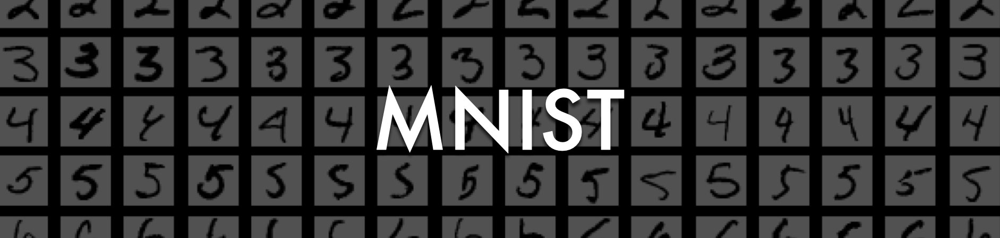

Ce projet propose une démonstration pédagogique en **Deep Learning** visant à entraîner un modèle de classification d'images pour reconnaître les chiffres manuscrits du jeu de données **MNIST**.  
Il est conçu pour comprendre les étapes fondamentales de la construction, de l'entraînement et de l'évaluation d'un modèle de réseau de neurones pour la classification d'images.

## Objectifs pédagogiques

- Comprendre les étapes de prétraitement des données d'images  
- Apprendre à construire et entraîner un modèle de réseau de neurones pour la classification  
- Évaluer les performances du modèle sur des données de test  

## Prérequis

- Python ≥ 3.10  
- Environnement Jupyter (ou autre IDE compatible)  
- Bibliothèques de Deep Learning (par exemple, TensorFlow ou PyTorch)  
- Connaissances en apprentissage automatique  

## Installation

1. Clonez le dépôt :

   ```bash
   git clone https://github.com/Sengsathit/Teaching-DL_demo_classification_mnist.git
   cd Teaching-DL_demo_classification_mnist
   ```

2. Créez un environnement virtuel (optionnel mais recommandé) :

   ```bash
   python -m venv venv
   source venv/bin/activate  # ou .\venv\Scripts\activate sous Windows
   ```

3. Installez les dépendances :

   ```bash
   pip install -r requirements.txt
   ```

4. Extrayez les données MNIST :

   ```bash
   tar -xzf mnist_data.tar.gz
   ```

   Cela créera le dossier `data/` contenant les images MNIST (273 MB décompressés).

5. Lancez le notebook :

   ```bash
   jupyter notebook
   ```

## Structure du projet

- `demo_mnist.ipynb` : notebook principal illustrant le processus de classification d'images avec le jeu de données MNIST
- `mnist_data.tar.gz` : archive compressée (20 MB) contenant les données MNIST
- `data/` : dossier créé après extraction de l'archive (non versionné dans Git)
- `img/` : ressources visuelles pour la présentation
- `requirements.txt` : liste des dépendances Python nécessaires  